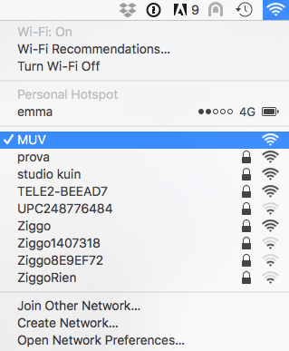
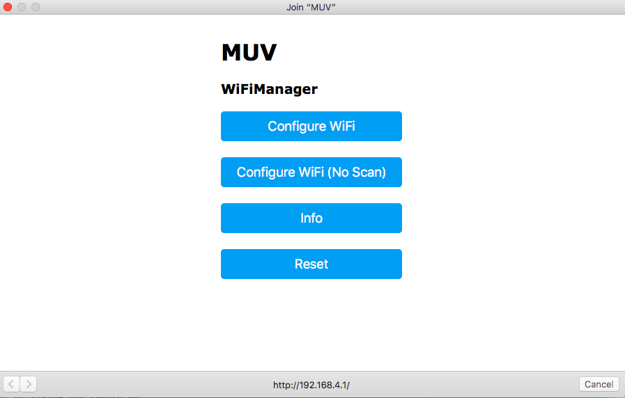
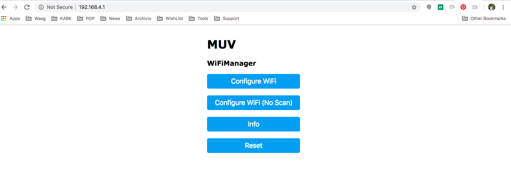
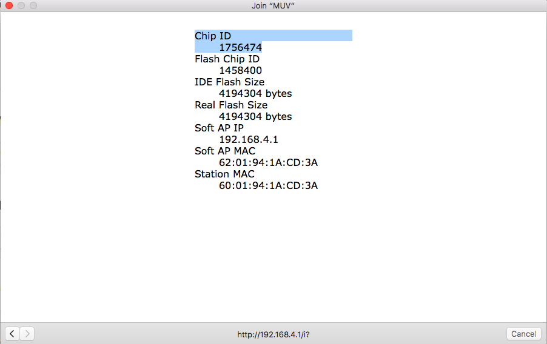
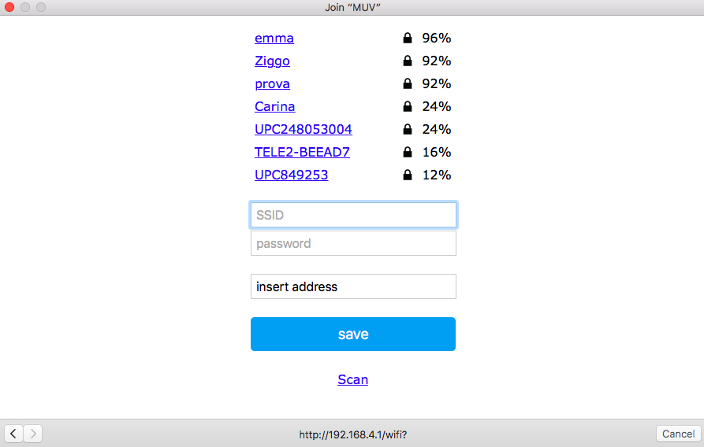
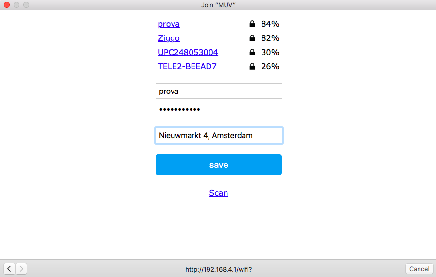
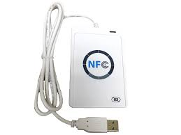

# PK_MUV

This page contains the description of the kit.

## Intro

## Application
The PK_MUV is a WiFi module (esp8266) with NFC reader (RC522).
The PK_MUV kit is programmed to read [Tag_MUV](MUV-Tags). When the user operates the TAG_MUV on PK_MUV kit, the check-in information are sent to the MUV server:
* Tag_MUV UID to identify the user
* PK_MUV ID to identify the location of the kit.
To have access to the key, see section [Contacs](#Contacts)

## Instructions
### Connect the PK_MUV to the local WiFi
Turn on the PK_MUV (ON/OFF switch). If the kit is not connected to the WiFi, the Config Led is on/blue, the kit is ready to be connected and it create a network named MUV.
At this point you need a smartphone/tablet or computer, join the network MUV.

Automatically on the device you are using (smartphone/tablet/computer) the configuration window will pop-up.

If the window doesn't appear, open a browser and go to the address: http://192.168.4.1/.

Clicking on Info, you can see the information related to the kit and find the PK_MUV kit ID that in the window is called Chip ID.

Clicking on Configure WiFi, you are in the right place to connect the kit to you local WiFi.

Select the WiFi and type the password.
In the tag "Insert address", write the location of the kit.

Click save and the kit will be now connected, the Config Led blinks green and you are ready to use the kit.
It is also possible to enter in configuration mode manually, see the below section "configuration mode".

### Modes and Routines
The operation of the PK_MUV can be described by modes and routine.
The modes are conditions in which the kit is waiting for some actions from the users:
* **configuration mode**: the kit is waiting to be connected to the local WiFi
* **operation mode**: the kit is operating and waiting to detect a Tag_MUV

The routines are a set of actions that the kit executes when it is triggered:
* **start-up routine**: it happens when the kit is powered-on or reset
* **tag routine**: it happens when the kit detect a tag
* **check routine**: it happens when the user need to check the functionality of the kit
The

#### Configuration Mode
The kit is in configuration mode when it is not connected to the Local WiFi. In configuration mode the Config Led is steady blue.
You can enter in configuration mode with the following steps: keep pushed the Config switch and reset the kit. Hold the Config switch until the Config Led blinks blue and you can connect the PK_MUV to the local Wifi, see previous section "Connect the PK_MUV to the local WiFi".

#### Operation Mode
If the kit has been successfully configured, it enters in operation mode.
The Tag Led and the Config Led are off, the NFC reader is ready to accept tags and the WiFi module is off to optimise the power consumption.
When the kit is operating and it has not been triggered by any tag, it will stay in operation mode.

#### Start-up routine
When the kit is powered-on or reset, it will go through a sequence of test to verify that the kit can properly operate.
It will connect to the local WiFi, it will verify the connection with the server and it will send a start-up message. If the execution of the start-up routine is successful the Config Led  blinks green light.

#### Tag Routine
When the reader get a Tag_MUV, the Tag Led blinks three times, meaning:
* the kit received a tag and the tag is recognised as Tag_MUV
* the kit connected to the local WiFi
* the kit sent the MUV message to the MUV server

If the Tag light blinks: green-read, it means the tag doesn't have the credential of the MUV project. 
If the Tag light blinks: green-blue, it means the tag was recognised as MUV, but the the kit couldn't connect to the WiFi. 
If the the light blinks: green-aqua, it means the tag was recognised as MUV, it could connect to the WiFi but it couldn't reach the MUV server.

#### Check Routine
To execute the check routine, press once the Config Switch and you can verify the following features:
* battery level
* WiFi connection
* MUV server connectivity

The Batt Led will be steady for few seconds and the colour represents the battery level. 
The feedback of the routine is visualised on the Config Led: 
Three green blinks: the kit is operating properly and it will send the "check message". 
Green-blue blink: the kit can't connect to the WiFi. 
Green-aqua blink: the kit can't reach the MUV server and the "check message" is not sent.

## Power supply and Batt Led
The PK_MUV kit runs on a rechargeable battery and its life in operation mode is about 4 days.
The Batt Led visualises the conditions:
* battery level > 50%: Batt Led blinks slow, colour green
* 50% > battery level > 30%: Batt Led blinks slow, colour orange
* 30% > battery level > 20%: Batt Led blinks slow, colour red.
* 20% > battery level > 10%: Batt Led blinks fast, colour red.
* battery level > 10%: Batt Led is steady on, colour red.

When the Batt Led is red, the battery is almost empty. To recharge the internal battery you can use a micro USB cable and a +5V USB charger (the ones you use with phones are good), plug the cable to the USB port on the side of the kit. When the Batt Led is steady green, the battery is charged. While the kit is under charge it, it still operates normally.

## MUV Tags
The Tags that have been successfully tested are NTAG2013 and NTAG203, they are manufactured in different shapes: key-chain, sticker, business card and bracelet.
To be able to use a Tag with the PK_MUV kit, you have to write in the Tag the MUV password and transform it in a Tag_MUV. On [this page](https://www.wakdev.com/en/apps.html) you find a list of apps to write NFC Tags but you also need a device to actually write the tag; in some cases the phone can do the job but in some other cases, for example if you have an iPhone6, you have to adopt an external device. During the testing phase of the PK_MUV, the ACR122 writer has been used with the desktop version of the software NFC tools.

How to use the ACR122 with NFC tools: [link](https://www.wakdev.com/en/apps/nfc-tools-pc-mac.html)
To have access to the key, see section [Contacts](#anchor-contacts).

## Contacts
To have access to the MUV password, please contact: XXX
