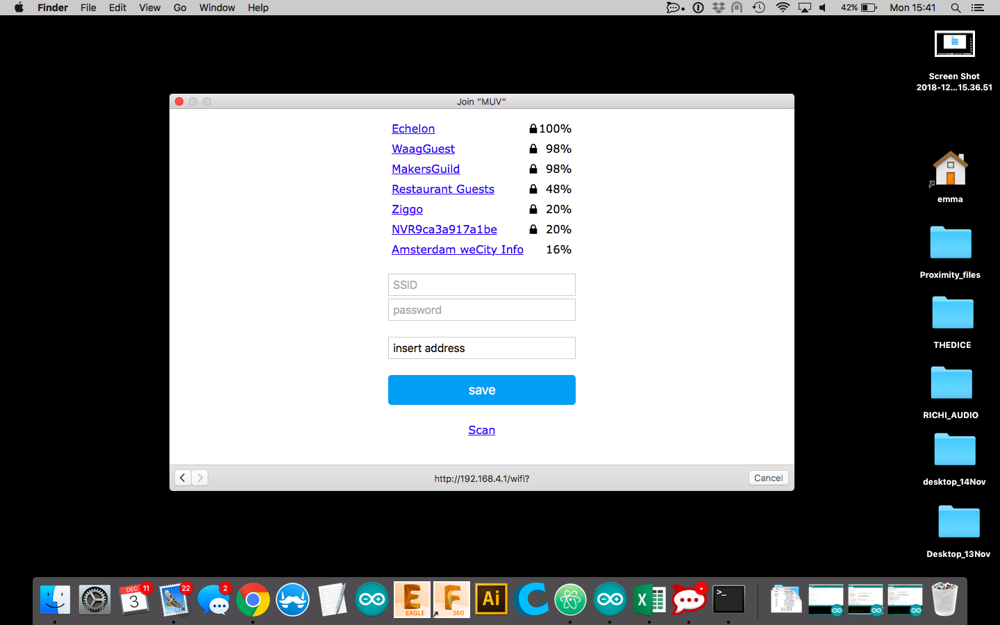

# PK_MUV

This page contains the description of the kit.

## Intro

## Application
The PK_MUV is a WiFi module (esp8266) with NFC reader (RC522).
The PK_MUV kit is programmed to read Tag_MUV. When the user operates the TAG_MUV on PK_MUV kit, the check-in information are sent to the server and they are:
* Tag_MUV UID to identify the user
* PK_MUV ID to identify the location of the kit.
To have access to the key, please contact XXX.

## Instructions
### Connect the PK_MUV to the local WiFi
Turn on the PK_MUV (ON/OFF switch). If the kit is not connected to the WiFi, the Config Led is on/blue, the kit is ready to be connected and it create a network named MUV.
At this point you need a smartphone/tablet or computer, join the network MUV.

Automatically on the device you are using (smartphone/tablet/computer) the configuration window will pop-up.

If the window doesn't appear, open a browser and go to the address: http://192.168.4.1/.

Clicking on Info, you can see the information related to the kit and find the PK_MUV kit ID that in the window is called Chip ID.

Clicking on Configure WiFi, you are in the right place to connect the kit to you local WiFi.

Select the WiFi and type the password.
In the tag "Insert address", write the location of the kit.

Click save and the kit will be now connected, the Config Led blinks green and you are ready to use the kit.

It is also possible to enter in configuration mode manually, see the below section "configuration mode".

### Modes and Routines
The operation of the PK_MUV can be described by modes and routine.
The modes are conditions in which the kit is waiting for some actions from the users:
* configuration mode: the kit is waiting to be connected to the local WiFi
* operation mode: the kit is operating and waiting to detect a Tag_MUV

The routines are a set of actions that the kit executes when it is triggered:
* start-up routine: it happens when the kit is powered-on or reset
* tag routine: it happens when the kit detect a tag
* check routine: it happens when the user need to check the functionality of the kit
The

#### Configuration Mode
The kit is in configuration mode when it is not connected to the Local WiFi. In configuration mode the Config Led is steady blue.
You can enter in configuration mode with the following steps: keep pushed the Config switch and reset the kit. Hold the Config switch until the Config Led blinks blue and you can connect the PK_MUV to the local Wifi, see previous section "Connect the PK_MUV to the local WiFi".

#### Operation Mode
If the kit has been successfully configured, it enters in operation mode.
The Tag Led and the Config Led are off, the NFC reader is ready to accept tags and the WiFi module is off to optimise the power consumption.
When the kit is operating and it has not been triggered by any tag, it will stay in operation mode.

### Start-up routine

#### Tag Routine
When the reader get a tag, the Tag Led blinks and the light colour sequence code is:
* green - aqua - green - aqua: the tag payload has been successfully sent to the server, see payload section in

####

## Battery

## MUV Tags

## Troubleshooting
