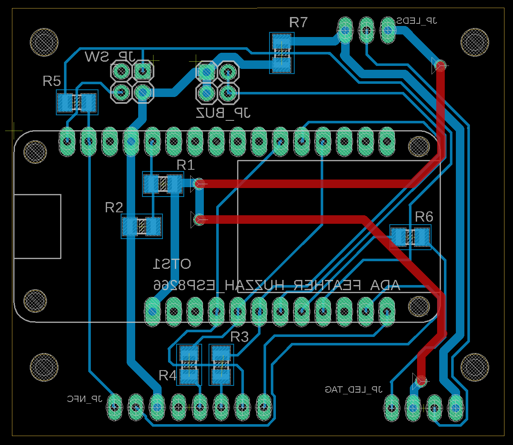
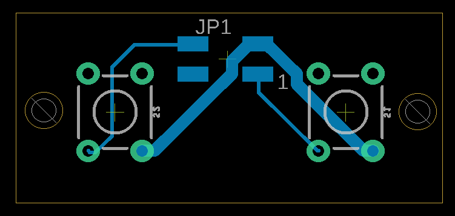

# Parts
The PK_MUV kit is a portable device made of the following parts and features:

* Mcu/WiFi: Adafruit Feather HUZZAH esp8266 board
* NFC Reader: RC522 NFC reader
* Visual feedback: 3 WS1282 LEDs
* Audio feedback: buzzer
* Power switch
* Reset button
* Configuration button
* Indicator RGB Led for battery status
* Indicator RGB Led for configuration mode
* Indicator RGB Led for feedback
* Power supply: rechargeable battery or micro USB cable
* 6 mounting holes

The PK_MUV uses two off-the-shelf boards, the Adafruit Feather HUZZAH esp8266 and the NFC reader RC522, and four boards made in the fablab, the PK_MUV pcb, the PK_MUV_L1 pcb, the PK_MUV_L2 pcb and the PK_MUV_sw pcb.

BLOCK DIAGRAM

The boards are made using the small milling machine Roland Modela MDX-20, each pcbs require two jobs: mill the trace and cut/drill the boards, in the folder digital files you find the png machinable files.
Tools used:
- one side copper plate, FR1
- to mill the traces: endmill, 0,4mm diameter
- to cut and drill: endmill, 1/64 inch diameter

The files used on the machine are in the folder [Machinable files](https://github.com/emmapa/proximity_kit/tree/master/PK_MUV/Tech/Machinable%20files). 
The original Eagle files are in the [Eagle files](https://github.com/emmapa/proximity_kit/tree/master/PK_MUV/Tech/Eagle%20files).

#### PK_MUV pcb

| top view  | bottom view |
| ------------- | ------------- |
| 

  | 

 |
|   |  |
| All the header are THT, pitch 2.54mm.   JP_LEDS: 1x3 female header, THT   JP_BUZ: 2x2 male header  JP_SW:   Feather header 1:   Feather header 2:   JP_LED_TAG:   JP_NFC:  | All the resistors are smd 1206.  R1:   R2:   R3:   R4:   R5:   R6: 470 Ohm   R7:  |

**note**: the red traces are jumper wires placed on the top layer

#### PK_MUV_L1 pcb

| top view  | bottom view |
| ------------- | ------------- |
| 

  | 

 |
|   |  |
| The header is THT, pitch 2.54mm.   JP1:  | Resistors and capacitors are smd 1206.  C1:   R1:   U1: WS2812 Led|

#### PK_MUV_L2 pcb

| top view  | bottom view |
| ------------- | ------------- |
| 

  | 

 |
| |  |
| The header is THT, pitch 2.54mm.   JP1:   | Resistors and capacitors are smd 1206.  C1=C2:   R1:   U1=U2: WS2812 Led |

#### PK_MUV_sw pcb

| top View  | bottom view |
| ------------- | ------------- |
| 

  | 

 |
| |  |
| The header is smd, pitch 2.54mm   JP1:  | sw1 = sw2 :  |

#### Battery cable

#### Assembly note
